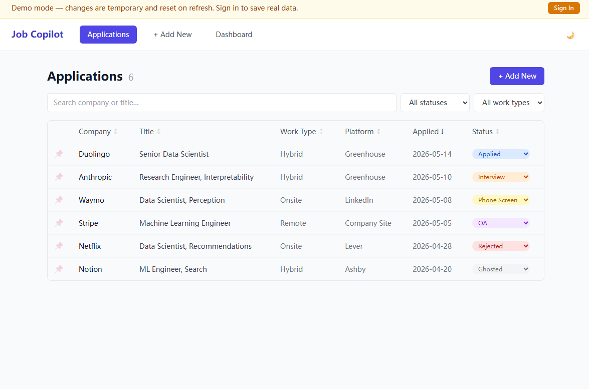
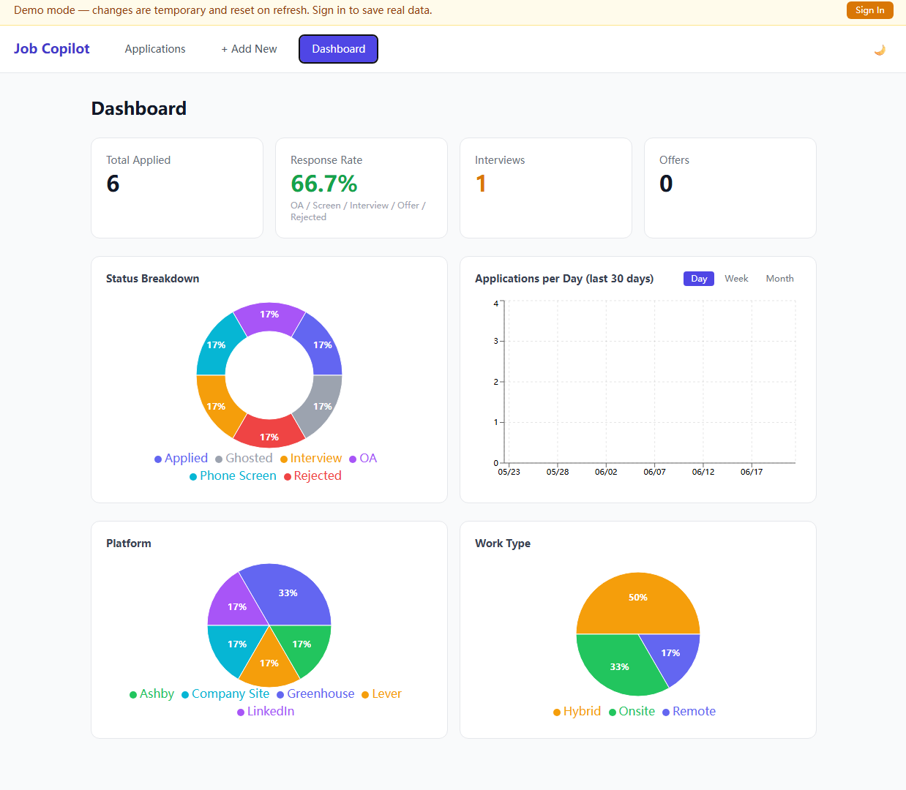
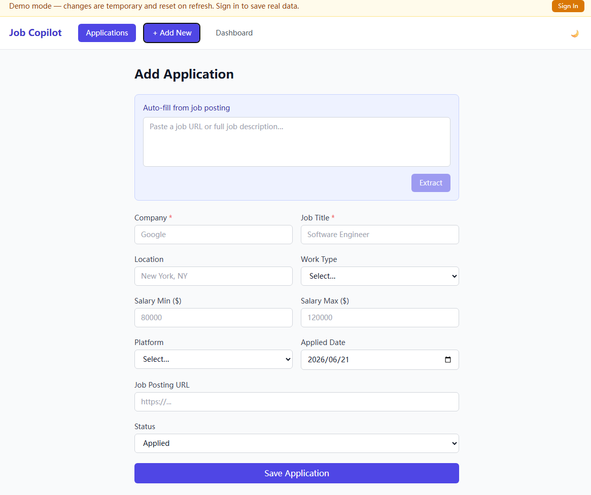
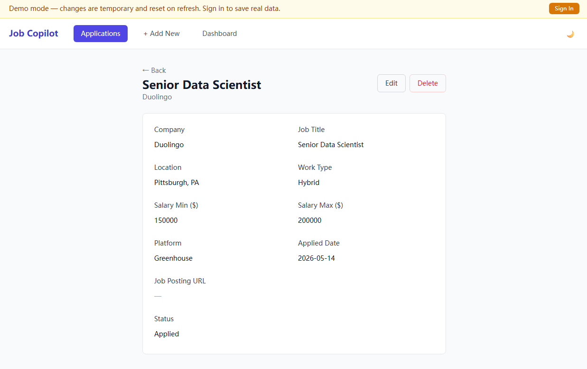
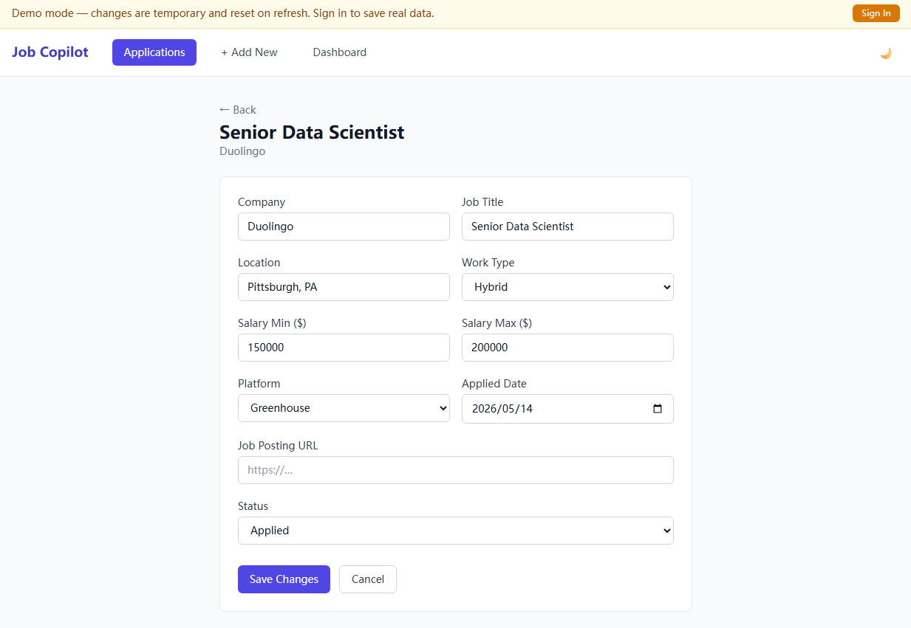

# Job Copilot

A full-stack job application tracker that auto-fills postings from a URL or raw text, tracks status through your pipeline, and visualizes your search on a stats dashboard.

**🔗 Live demo:** https://job-copilot-frontend.onrender.com — opens in **demo mode** with sample data, no sign-up required. Changes are kept in your browser and reset on refresh.


> _Note: the demo is hosted on Render's free tier and sleeps after ~15 min of inactivity, so the first load may take ~30s to wake up._

## Screenshots

**Applications — searchable, sortable list with inline status updates and pin-to-top**



**Dashboard — response rate, status breakdown, application trend, and platform / work-type distribution**



**Add Application — paste a job URL or JD and auto-fill the form**



<details>
<summary>More screenshots (detail & edit views)</summary>

**Application detail**



**Inline edit**



</details>

## Features

- **Auto-fill from a posting** — paste a job URL or raw job-description text and the app extracts title, company, location, salary, and work type automatically.
- **Cascading extraction pipeline** — JSON-LD structured data → Jina Reader (rendered text) → optional Groq LLM → custom spaCy NER, each step a fallback for the previous one.
- **LLM extraction (optional)** — a Groq `llama-3.3-70b` pass improves accuracy; the pipeline silently falls back to regex + spaCy when no API key is set.
- **Pipeline tracking** — add, edit, delete applications; one-click status changes across `Applied → OA → Phone Screen → Interview → Offer / Rejected / Ghosted`; pin important ones to the top.
- **Search, filter & sort** — filter the list by status and work type, search by company or title, and sort any column.
- **Dashboard** — response rate, status breakdown, an application trend chart (day / week / month), and platform & work-type distribution, built with Recharts.
- **Demo mode** — try the full UI instantly with seeded sample data stored client-side; no backend or account needed.

## Tech Stack

| Layer | Technology |
|-------|-----------|
| Frontend | React 18, Vite, Tailwind CSS, Recharts |
| Backend | FastAPI, SQLAlchemy, Python 3.12 |
| NLP | spaCy 3 (custom NER) + Groq LLM (optional) |
| Database | PostgreSQL 16, Alembic migrations |
| Infrastructure | Docker Compose, GitHub Actions (CI), Render |

## Architecture

Three Docker services orchestrated with Docker Compose:

- **`db`** — PostgreSQL 16, schema managed by Alembic migrations.
- **`backend`** — FastAPI app exposing `/api` routes for applications, extraction, and stats.
- **`frontend`** — React + Vite SPA, hot-reloading in development.

### Extraction pipeline

`POST /api/extract` accepts `{url}` or `{text}` and runs four strategies in priority order:

1. **JSON-LD** — parses `<script type="application/ld+json">` `JobPosting` data (works on server-rendered sites).
2. **Jina Reader** — fetches rendered page text + a reliable title for SPAs.
3. **LLM extraction** — sends the text to Groq; skipped when `GROQ_API_KEY` is unset.
4. **Regex + custom spaCy NER** — a `JOB_TITLE` / `COMPANY` model fine-tuned from `en_core_web_sm` as the final fallback.

## Local Development

**Prerequisites:** Docker Desktop

```bash
git clone https://github.com/Xing312/job-copilot.git
cd job-copilot
make start

# App is running at:
#   Frontend  →  http://localhost:5173
#   Backend   →  http://localhost:8000
```

The `./backend` directory is volume-mounted, so Python changes take effect without rebuilding. The frontend hot-reloads via Vite (polling enabled for WSL compatibility).

### Common commands

```bash
make start      # start all services in background
make stop       # stop all services
make restart    # restart backend (after Python changes)
make logs       # tail backend logs
make test       # run the pytest suite inside the backend container
make migrate    # apply pending Alembic migrations
make train      # retrain the custom spaCy NER model
```

### Environment variables

Copy `.env.example` to `.env` to customize database credentials.

To enable LLM-based extraction, add a Groq API key (free tier at [console.groq.com](https://console.groq.com)):

```
GROQ_API_KEY=gsk_...
```

If `GROQ_API_KEY` is empty, the pipeline skips the LLM step and uses regex + spaCy only.

## Demo Mode

The app has **no login or password**. A single build-time flag, `VITE_FORCE_DEMO`, decides how it behaves:

| `VITE_FORCE_DEMO` | Behavior |
|-------------------|----------|
| _unset_ (default) | **Normal mode** — a local clone talks to the real backend + PostgreSQL and persists your data. This is what you get from `make start`. |
| `true` | **Demo mode** — used by the public deployment. All reads and writes use seeded sample data kept in the browser's `sessionStorage`; nothing touches the database, so the demo is read-safe and resets when the tab is closed. |

In demo mode the only backend call that still runs is `POST /api/extract` (the auto-fill endpoint), which is stateless and writes nothing.

To preview the demo build locally:

```bash
cd frontend
VITE_FORCE_DEMO=true npm run dev
```

## Project Structure

```
├── backend/
│   ├── api/            # FastAPI routers (applications, extract, stats)
│   ├── db/             # SQLAlchemy engine and session
│   ├── models/         # ORM models
│   ├── services/       # extractor.py (regex/NER), llm_extractor.py (Groq)
│   ├── alembic/        # database migrations
│   └── tests/          # pytest suite (SQLite in-memory)
├── corpus/
│   ├── annotations.json        # NER training data (107 examples)
│   ├── job_copilot_ner/        # trained spaCy model
│   └── train.py                # training script
├── frontend/
│   └── src/
│       ├── api/        # fetch wrappers
│       ├── components/ # NavBar
│       ├── demo.js     # client-side demo mode (seeded sample data)
│       └── pages/      # Applications, AddApplication, ApplicationDetail, Dashboard
├── scripts/            # corpus-building utilities
├── docker-compose.yml
├── render.yaml         # Render Blueprint for deployment
└── Makefile
```

### Testing

```bash
make test
```

Runs the backend suite inside Docker (pytest, SQLite in-memory): CRUD routes,
stats, and unit tests for the extraction logic (JSON-LD parsing, salary / work-type
/ title regex, platform detection). CI additionally applies the Alembic migrations
against a real PostgreSQL service to catch migration regressions.

## NER Model

The custom NER model is fine-tuned from `en_core_web_sm` to recognize `JOB_TITLE` (F=0.81) and `COMPANY` (F=0.28) entities in job-posting text. It is the last fallback when structured extraction (JSON-LD / title-line regex / LLM) finds nothing.

To retrain after editing `corpus/annotations.json`:

```bash
make train
make restart
```

## Contributing

Changes go through a pull-request workflow: branch off `main`, open a PR, and merge
once CI is green. `main` is protected and deploys to production. See
[CONTRIBUTING.md](CONTRIBUTING.md) for details.

## License

MIT © [Xing312](https://github.com/Xing312)
